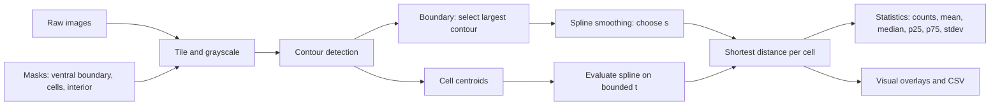

# NeuroMap: Spatial Quantification of SNC Neurons

## 📌 Introduction
NeuroMap is a computational pipeline that quantifies the spatial organization of substantia nigra pars compacta (SNC) neurons from histological images. The primary objective is to measure the shortest distance between each neuron and the ventral (or dorsal) boundary. The pipeline combines standardized image masks, OpenCV contour detection, spline-based boundary smoothing, and bounded evaluation to compute accurate shortest distances and produce interpretable statistics such as mean, standard deviation, median, and quartiles.

---

## 🏗️ Architecture

---

## 🧪 Techniques Used
- **Image Segmentation and Standardization:** Images are tiled to uniform sub-images, converted to grayscale, and prepared so each tile contains isolated instances. Cell masks (Aldh1a1⁺ and Aldh1a1⁻) are scaled to avoid overlap and ensure one cell per tile.
- **OpenCV Contour-Based Extraction:** The ventral boundary is identified as the largest connected contour, while cell contours are reduced to centroids that represent neuron locations for downstream analysis.
- **Spline Interpolation with Smoothing:** A parametric spline is fit to boundary points, with a smoothing factor adjusted to reduce jaggedness while preserving anatomical shape.
- **Shortest-Distance Computation:** For each centroid, the spline is evaluated across a bounded parameter range to compute Euclidean distances, selecting the minimum and recording the closest boundary point.
- **Statistical Summaries:** The pipeline reports counts and distributional statistics (mean, standard deviation, median, P25, P75), enabling comparison across images or subjects.

---

## 🚧 Future Improvements
- Improve robustness of the counting algorithm.
- Add batch automation to run across multiple subjects.
- Generate sample images and counts automatically for documentation and testing.

